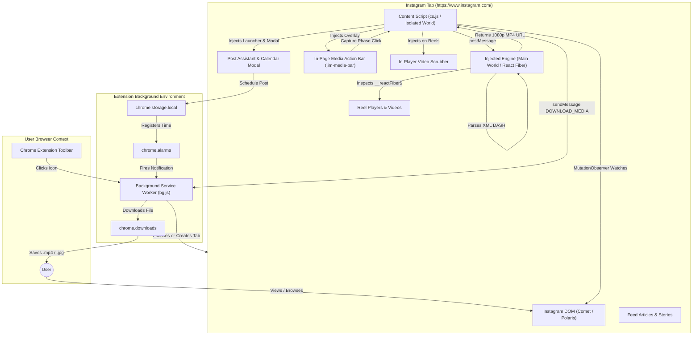
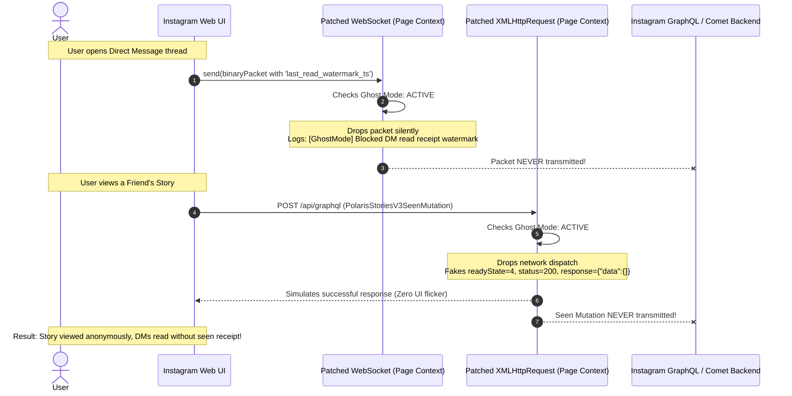
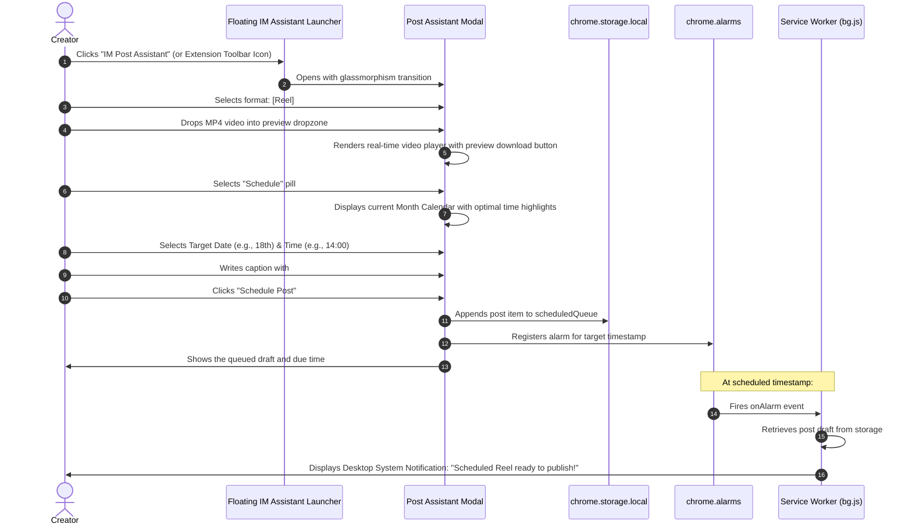
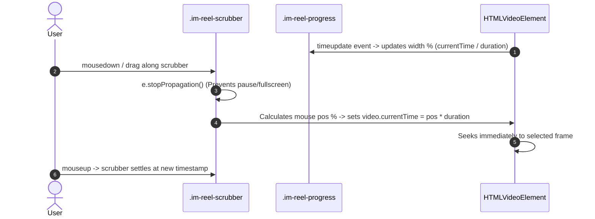
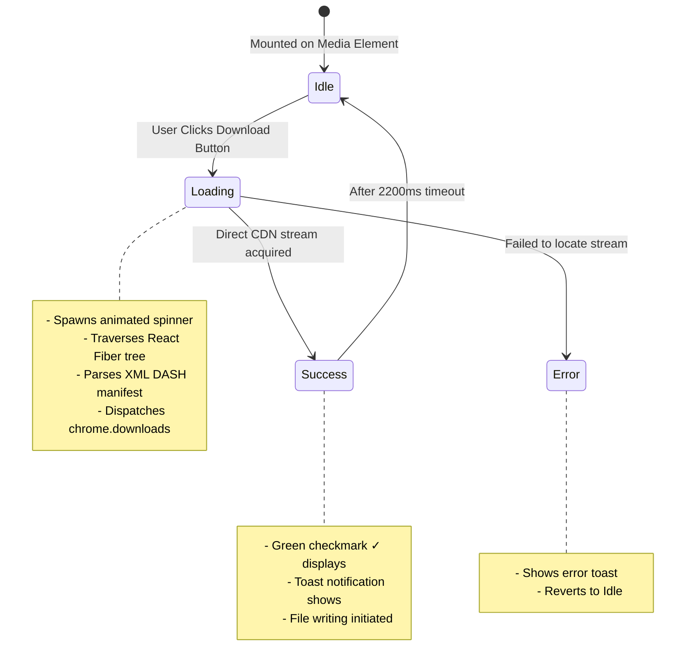

# Application Flow & Architecture Document

## Project: InstaManager (Instagram Assistant & Growth Suite)
- **Document Version**: 1.0.0
- **Author**: Avichal Goyal (Mythos / Antigravity)

---

## 1. System Topology & Architecture



---

## 2. Core User Workflows & Sequence Diagrams

### 2.1 Workflow 1: In-Page Reel Browsing & 1-Click HD Download

When a user watches any Reel on Instagram, the floating download button appears seamlessly over the video.

```mermaid
sequenceDiagram
    autonumber
    actor User
    participant Reel as Reel Video Player (DOM)
    participant Bar as MediaActionBar (.im-media-bar)
    participant CS as Content Script (cs.js)
    participant Page as Page Context (Main World)
    participant SW as Service Worker (bg.js)
    participant Chrome as Chrome Downloads API

    Reel->>CS: MutationObserver detects new video node
    CS->>Bar: Mounts circular download button (z-index: 99999)
    Note over Bar: Button fades in with subtle glassmorphism

    User->>Bar: Clicks Download Button (Capture Phase: true)
    Bar->>Bar: e.stopPropagation() (Prevents video pause)
    Bar->>Bar: Sets button state to animated spinner
    Bar->>CS: Requests media resolution for video element

    CS->>Page: window.postMessage("insta-manager-resolve-request")
    Note over Page: Inspects video.__reactFiber$...<br/>Walks fiber tree to find manifest props<br/>Locates XML DASH <MPD> string
    Page->>Page: Parses MPD; selects video/audio representations and resolves inherited BaseURLs
    alt supported single-file media
        Page-->>CS: { url: directMediaUrl }
    else supported split tracks
        Page-->>CS: { url: videoUrl, audioUrl: audioUrl }
    else protected or segmented media
        Page-->>CS: { unsupportedReason }
        CS->>Bar: Returns to Idle and displays truthful error toast
    end

    CS->>SW: chrome.runtime.sendMessage({ type: "DOWNLOAD_MEDIA", data: { url, audioUrl?, filename, requestId } })
    opt separate audio
        SW->>SW: Uses extension offscreen document to remux local video and audio tracks
    end
    SW->>Chrome: chrome.downloads.download({ url, filename, saveAs: false })
    Chrome-->>SW: onChanged terminal state
    SW-->>CS: DOWNLOAD_STATUS { requestId, status: done | error }
    alt completed
        CS->>Bar: Sets button state to green checkmark (✓)
        CS->>User: Displays "Download completed" toast
    else interrupted
        CS->>Bar: Returns button to Idle
        CS->>User: Displays error toast
    end
```

---

### 2.2 Workflow 2: Ghost Mode Privacy Shield (DMs & Stories)

Ghost Mode operates transparently in the background, suppressing read indicators while keeping the UI fully responsive.



---

### 2.3 Workflow 3: Post Assistant & Content Scheduling

Creators can craft and queue content directly from the in-page assistant without navigating away.



---

### 2.4 Workflow 4: Interactive Reel Video Scrubber



---

## 3. Component Interaction Matrix

| Initiating Component | Target Component | Protocol / API | Data Exchanged |
| :--- | :--- | :--- | :--- |
| **Content Script (`cs.js`)** | Injected Page Script | `window.postMessage` | `{ source, requestId, targetAttr, targetVal }` |
| **Injected Page Script** | Content Script (`cs.js`) | `window.postMessage` | `{ source, requestId, url: "https://..." }` |
| **Content Script (`cs.js`)** | Service Worker (`bg.js`) | `chrome.runtime.sendMessage` | `{ type: "DOWNLOAD_MEDIA", data: { url, filename } }` |
| **Service Worker (`bg.js`)** | Content Script (`cs.js`) | `chrome.tabs.sendMessage` | `{ type: "TOGGLE_ASSISTANT" }` |
| **Service Worker (`bg.js`)** | Chrome Download Manager | `chrome.downloads.download` | `{ url, filename, saveAs: false }` |
| **Service Worker (`bg.js`)** | Chrome Cookie Jar | `chrome.cookies.get / getAll` | `sessionid`, `csrftoken`, `ds_user_id` |
| **Post Assistant UI** | Extension Storage | `chrome.storage.local` | `{ scheduledPosts: [...], ghostSettings: {...} }` |

---

## 4. State Transition Model: Media Downloader Button


